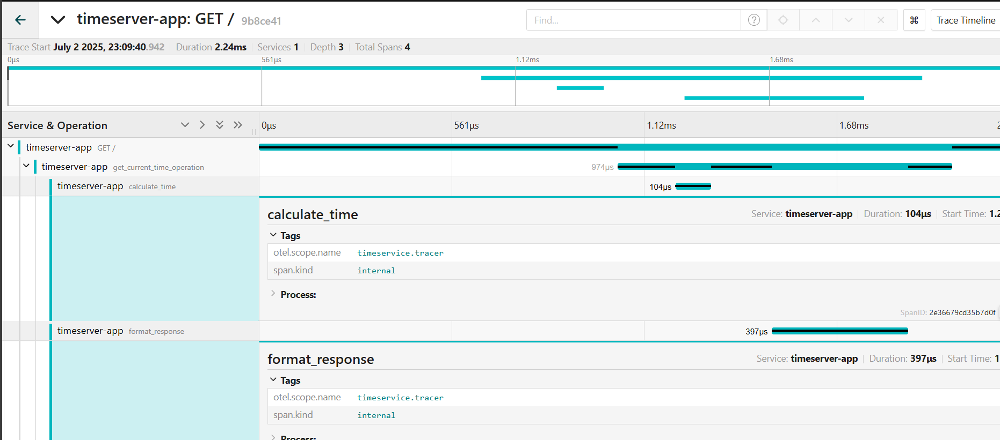
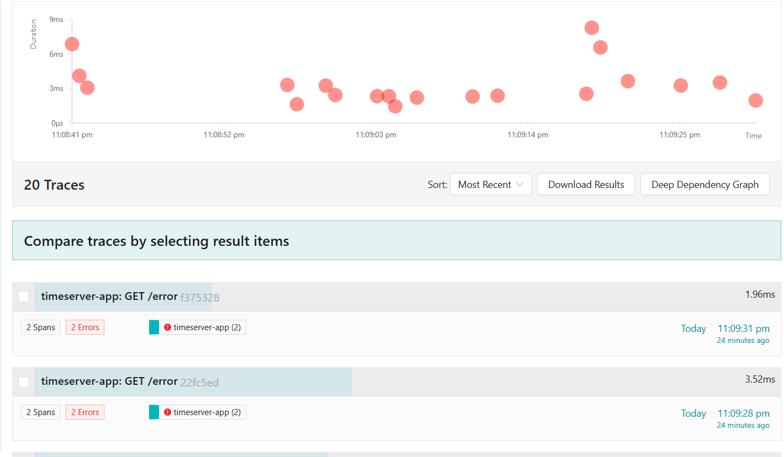

## Recursos de K8s

Los recursos de K8s permiten desplegar y gestionar los servicios de manera eficiente. La funcion de cada archivo es:

1. **deploy.yaml**: En este manifest define los despliegues de las aplicaciones. Contiene especificaciones como replicas, contenedores, imagenes y configuraciones necesarias para que los pods funcionen correctamente con su version.

2. **service.yaml**: Este manifest configura los servicios que exponen los pods al exterior o a otros servicios dentro del cluster. Define detalles como el tipo de servicio (ClusterIP, NodePort, LoadBalancer) y los puertos expuestos.

3. **jaeger.yaml**: Este manifest configura Jaeger dentro del cluster de Kubernetes. Incluye los componentes necesarios para recolectar, procesar y visualizar trazas de las aplicaciones.

## Trazabilidad con Jaeger

Jaeger es una herramienta de trazabilidad distribuida que permite monitorear y depurar aplicaciones complejas. En este proyecto, se utiliza para rastrear las solicitudes que pasan a traves de los diferentes servicios desplegados en Kubernetes.

### Configuracion de Jaeger

El archivo `jaeger.yaml` incluye la configuracion necesaria para desplegar Jaeger en el cluster. Esto incluye:

- **Agent**: Recolecta las trazas enviadas por las aplicaciones.
- **Collector**: Procesa y almacena las trazas recolectadas.
- **Query**: Proporciona una interfaz para consultar y visualizar las trazas.
- **UI**: Una interfaz grafica para explorar las trazas y analizar el rendimiento de los servicios.

### Integracion con las aplicaciones

Para que las aplicaciones puedan enviar trazas a Jaeger, es necesario configurar un cliente de trazabilidad en el codigo de las aplicaciones. Esto incluye:

- Especificar la direccion del agente de Jaeger.
- Instrumentar el codigo para capturar las operaciones relevantes.

### Setup

En directorio raiz:

```sh
make build-image
make setup
```

Estos comandos de Makefile construyen la imagen de Docker para la aplicacion y despliegan los recursos de Kubernetes necesarios.

Estos recursos desplegaran la app de Flask y la UI de Jaeger en los suientes puertos:

```sh
http://localhost:30686  # UI de Jaeger
http://localhost:8080  # App de Flask
```

Al ir al panel de UI de Jaeger se podran observar las trazas:



Despues en directorio raiz, se puede usar el script para realizar requests:
```sh
bash ./scripts/stress_test.sh
```

Para teardown de recursos de Kubernetes:

```sh
make clear
```