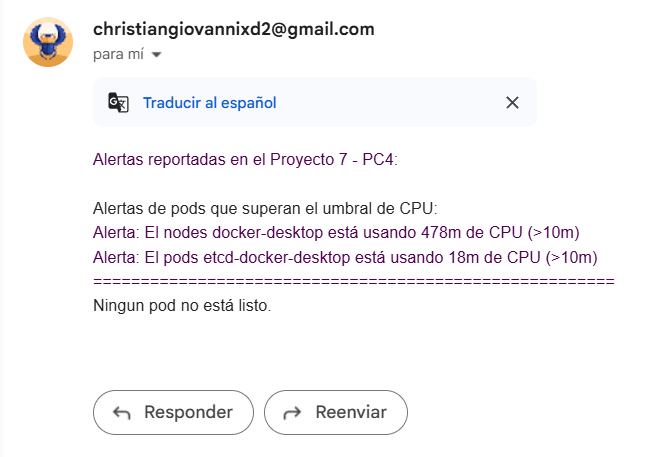

# Práctica Calificada 5
## Título del proyecto: [Observabilidad-de-cluster-Kubernetes-local](https://github.com/grupo10-CC3S2/Proyecto7-PC4)
## Número de proyecto: 7
## Repositorio del proyecto: [Link](https://github.com/grupo10-CC3S2/Proyecto7-PC4)
## Repositorio individual PC4: [Link](https://github.com/Chriss5-2/Observabilidad-de-cluster-Kubernetes-local)
## Funcionalidad: *`AlertManager` para notificaciones*
---
### Estudiante a cargo: Christian Giovanni Luna Jaramillo
### Código de estudiante: `20211374B`
### Usuario Github: [`Chriss5-2`](https://github.com/Chriss5-2)
### Repositorio Actividades: [Actividades](https://github.com/Chriss5-2/CC3S2-A_25-1_20211374B)
---
### Nombre de rama: `feature/christian/alertmanager`
---
---
# Actividad realizada en la PC5
## Asignación de puertos y servidores
Esta primera parte, se va a encargar de basicamente, usar el servidor público de de Gmail provisto para aplicaciones externar para enviar mensajes por correo electrónico, usando cuenta **Gmail** por ello es importante que más adelante, se asigne una cuenta gmail que va a ser la encargada de enviar los mensajes a los correos registrados, para usar este servidor público, se crea la variable `smtp_server` la cual tendrá como valor `smtp.gmail.com` diciendole al sistema que se usará el **SMTP** (`Simple Mail Transfer Protocol`) de Gmail y a la vez, se crea la variable `port` la cuál tal como se traduce, es el puerto que se usará, pero en este caso se le asignará el puerto `587` ya que este es el puerto estándar para **SMTP** con **STARTTLS** que basicamente es `Establecer conexión sin cifrar` + `Crear una conexión segura usando TLS` -> `Método de Google para enviar correos con autenticación y cifrado seguro`

---
## Guardando alertas
Anteriormente se tenía que `metric_visualizer.py` revise los archivo generados por `metric_collector.py` y de acuerdo a esas métricas, realizar tres cosas
- Mostrar las métricas en la terminal de manera legible
- Generar archivos html para su visualización mediante gráficas de barras
- Mostrar alertas de los pods (Superación de umbreales y Pods no listos)

Teniendo eso como base, para la Práctica 5 elegí la tarea de `Alertmanager para notificaciones` lo cuál según investigué, abarcaría más que nada de notificar a los miembros del equipo sobre las alertas presentes en el sistema, y la forma de realizar ello, sería enviando correos electrónicos de formato simple pero que sea entendible para cualquier integrante y se verá de la siguiente manera


Para lograr esto se comienza con crear variables que guardarán las alertas `msg_umbral` para las alertas donde se supera el umbral y `msg_ready` para las alertas donde los pods no están listos, cada variable será una lista de strings así que por ello se aplicará `"\n".join(m for m in msg_umbral if m is not None) if msg_umbral else "No se generaron alertas."` el cuál leerá todas las alertas de `msg_umbral` guardadas y las parseará para que se unan en un solo string donde cada alerta estará en una línea diferente y eso sería todo para guardar el mensaje a enviar

---
## Identificación de usuario
Para esta parte del código, es necesario asignar un correo y contraseña para poder enviar correos electrónicos a cada miembro desde esa cuenta, el correo se escribirá tal cual es en la variable `login`, pero para la contraseña no, porque gmail deshabilitó la capacidad de que python tenga acceso directo al correo con solo su correo y contraseña, así que para ahora tener la contraseña que ayuda a identificarnos con el correo, investigué y logré encontrar que la forma para identificar al correo mediante python, también es con contraseña de gmail pero con una que se generá automáticamente al activar la verificación de dos pasos, y dirigirnos a la sección de 
[Contraseña de aplicaciones](https://myaccount.google.com/u/3/apppasswords?rapt=AEjHL4PqkhxUBHwWiIDuORk-Tj4byP2Q4lppISw8xPOFUo0MXyRPOwbcax232eyCF709oaX30ZOmB8Oea7e2cj7L020ocSLDGfPYTD5PgFnMV8_PZzYa7lw&pli=1), al crear una nueva contraseña y asignar un nombre cualquiera, esto nos generará un código de tipo `wvns xury dfrj fwnz` el cual será nuestro identificador para logearnos a la cuenta desde aplicaciones externas, así que esta contraseña tendrá que ir en la variable `password` luego de eso, se crean otras dos variables que son el `sender_email` el cuál será la variable `login` (**La variable login debe ser un string**) ya que este correo será el que envía a los demás, y la otra variable es `receiver_email` el cuál puede ser solo un email string o puede ser una lista de emails, lo que sucede en este caso, que le asignamos el correo de todos los miembros del grupo
```python
receiver_email = ["christiangiovannixd@gmail.com", "christian.luna.j@uni.pe", "azvegab@gmail.com", "jesus.osorio.t@uni.pe"]
```

---
## Crear mensajes
Para esta parte, que van de la línea **204** a **217** sobre la cuál se va a encargar de verificar si las variables creadas anteriormente `msg_umbral` y `msg_ready` están vacías o no, y en caso no estén vacías, lo que harán será convertir estas variables en un formato de un solo string y no un string lis, para así, poder concatenar los strings que queremos se presenten en el correo y al finalizar, enviar solo la variable `text` que guarda todo lo que se quiere enviar en formato string, y así informar a todos los miembros acerca de las alertas detectadas en los pods

---
## Preparar mensaje
Esta penúltima parte, abarcará desde la línea **220** a la **232** del script [metric_visualizer.py](../scripts/metric_collector/metric_visualizer.py) y lo que se hace es, leer todos los correos electrónicos que contiene la variable `receiver_email` y de acuerdo a ello, empezar a crear la estructura del mensaje `Subject`, `From`, `To` que son basicamente `Asunto`, `Emisor`, `Receptor` y para obtener esa estructura en la variable `message` lo que se hace es generar una isntancia **MIMEText** el cuál genera un objeto **MIME** (`Multipurpose Internet Mail Extensions`) y a partir de este punto, ya se tiene a `message` como un objeto capaz de enviar mensaje, y como se puede notar, al crear el objeto **MIME** en la línea **229** se asigna como argumento, la variable **text** obtenida anteriormente, por lo tanto ya se tiene listo el mensaje a enviar, y aquí es donde `message` empezará a guardar los datos como estructura de mensaje `message["Subject]`, `message["From"]` y `message["To"]` para ser enviado. 

---
## Enviar mensaje
Para finalizar con la función, lo que se hace es **abrir una conexión SMTP** con el servidor de Google
```bash
with smtplib.SMTP(smtp_server, port) as server
```
El **with** nos indica que se cerrará la conexión al terminar de enviar el mensaje, `smtp_server` es el argumento que indica el servidor sobre el cuál se conectará la conexión, y `port` es el puerto para enviar mensajes, ahora, como usamos el puerto **587**, a la conexión creara, se le aplicará el método `starttls` para establecer una conexión segura y proteger el mensaje a enviar, luego el método `login()` sirve para basicamente autenticar el usuario en el servidor **SMTP** y por último, al ya tener la conexión segura, y el usuario que envía el mensaje autenticado, procedemos a usar el método `sendmail` para enviar el mensaje desde `sender_email` a `email` y como último argumenteo, se convierte el objeto **MIMEtext** en un string que el servidor es capaz de entender y enviar el mensaje deseado.

Con estos pasos, se completaría la `Conexión al servidor` -> `Generación de mensaje` -> `Envío de mensaje` para mantener un sistema de alertas basado en notificaciones vía mail.