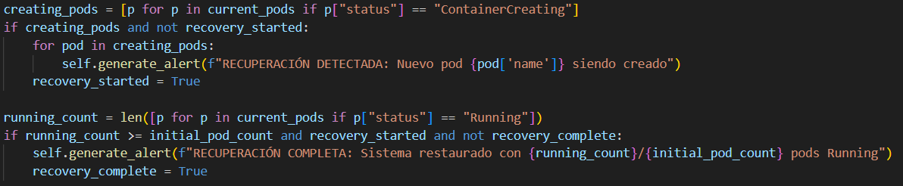
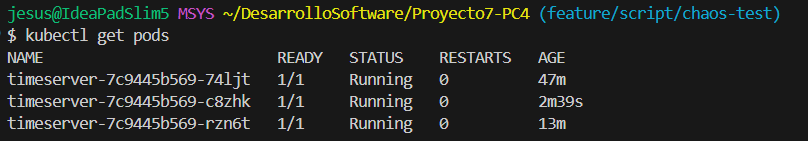
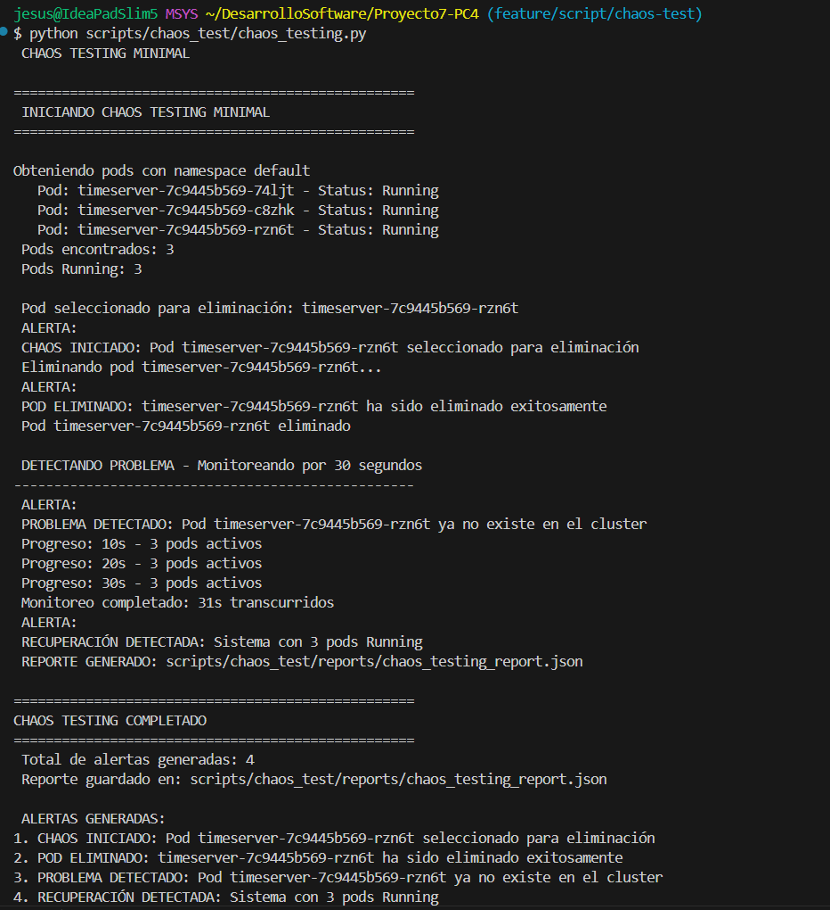
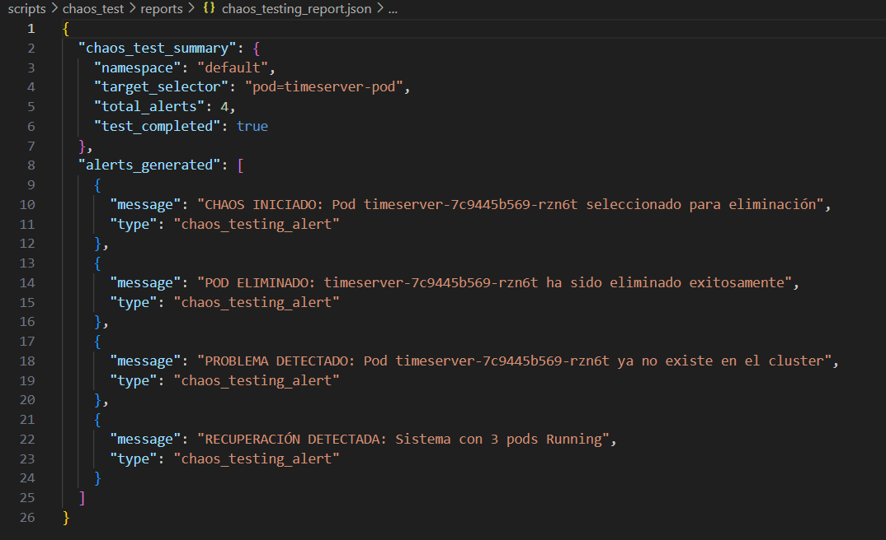
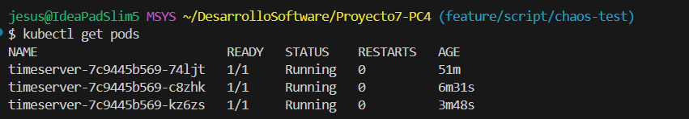

# Chaos Testing Minimal

Implementamos `chaos_testing.py` que simula la eliminación de un Pod y observa cómo se detecta el problema generando alertas.

## Este script tiene como componentes:

- Clase MinimalChaosTest, que maneja todo el flujo de chaos testing.
- Cuenta con un sistema de alertas que detecta y registra eventos durante el proceso.
- Selecciona aleatoriamente un pod que será eliminado controladamente.
- Un monitoreo de recuperación automática.
- Para más orden también genera un reporte en formato .json.

## Ahora también tenemos algunos detalles que tenemos que tener en cuenta.

Hay alertas, como las siguientes, que no se detectan.



Esto se debe a que Kubernetes es extremadamente rápido para generar nuevamente un pod. A pesar de que tenemos un intervalo de checkeo de 1 segundo, `ContainerCreating` dura menos de un segundo en Docker Desktop por lo cual no se detectan estas dos alertas. Sin embargo, no es un gran problema porque finalmente podemos visualizar el pod nuevo creado con el comando `kubectl get pod`.

## Uso del script

- Ejecutamos el script. Para esto debemos tener Kubernetes funcionando y también al menos 2 pods `timeserver` en status Running.

    ```py
    python scripts/chaos_test/chaos_testing.py
    ```

- Esto nos generará  `scripts/chaos_test/reports/chaos_testing_report.json`

## Ejemplo de uso

1. Visualizamos que pods tenemos antes de ejecutar nuestro script.
    
    

2. Ejecutamos nuestro script, vemos los problemas generados y que alarmas se detectan.

    

    Acá es donde debería mostrarse las alertas mencionadas, luego de la alerta _PROBLEMA DETECTADO: Pod timeserver-7c9445b569-rzn6t ya no existe en el cluster_, pero vemos que inmediantamente, a pesar de la confirmación de la eliminación del pod, está corriendo un nuevo pod.

3. Archivo .json generado.

    
    Vemos que nos muestra las 4 alertas detectadas.

4. Vemos un nuevo pod en status running.

    
